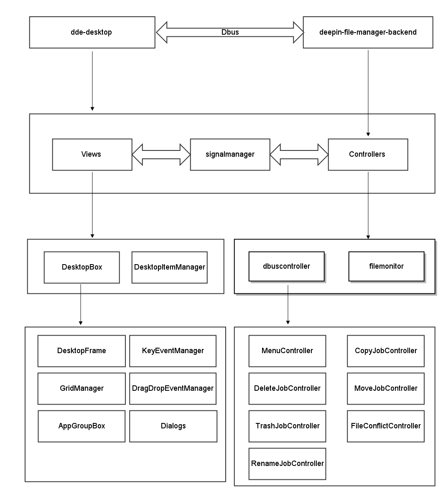

dde-desktop技术架构
=================
#####1. 需求要点
+ 桌面每个Item（以下简称`DesktopItem`）对应一个文件或文件夹，每个DesktopItem包含图标、文字、相应的权限指示图标；DesktopItem主要由四个部分组成：
    + DesktopItem图标：
        + 文件
            + 普通文件 --- 显示对应文件类型的图标，图标由主题决定
            + 应用程序Desktop文件 ---- 显示应用程序的图标，图标由主题和应用程序共同决定
            + 图片文件 --- 显示对应图片的缩略图
        + 文件夹 
            + 普通文件夹 --- 显示当前主题下的文件夹图标
            + 程序组 --- 显示程序组的缩略图
    +  DesktopItem文字：
        + 文字显示有两种状态，收缩显示和展开显示，这个跟文本长度有关系
            + 未选中状态 ---- 收缩显示
                + 文字长度多余两行 --- 第二行缩略显示,...显示中第二行中间，保证后缀名可见
           + 选中状态 --- 展开显示
               +  文字长度多余两行 ---  全部展开显示
               +  文字少于等于两行的，选中与未选中没有任何区别
    +  DesktopItem状态：
          +  无鼠标事件时显示normorl状态 
          + 鼠标hover上去显示hover状态
          + 鼠标点击上去显示check状态、
          + 剪切时候显示剪切状态
    + DesktopItem权限指示图标：
        + 可读指示
        + 只读指示

+ DesktopItem选中操作：
    +  鼠标点击DesktopItem选中
    +  鼠标点击桌面获得键盘焦点快捷键选中： 
        + 第一次按上/下/左/右,先选中上次选中的DesktopItem，
        + 第二次及多次按上/下/左/右键
             + 上： 选中同一列中上一行的DesktopItem， 到第一行就不要动了
             + 下： 选中同一列中下一行的DesktopItem， 到最后一行就不要动了
             + 左： 选中同一行中左一列的DesktopItem， 到最左边一列就不要动了
             + 右： 选中同一行中右一列的DesktopItem， 到最右边一列就不要动了
        + Home： 选中第一个DesktopItem （第一个DesktopItem是最左列最上面那一个DesktopItem）
        + End:       选中最后一个DesktopItem （最后一个DesktopItem是最后一列的最后一个DesktopItem）
        + Shift + Home: 从当前DesktopItem开始， 选中到第一个DesktopItem；（顺序从下到上， 从右到左）
        + Shift + End: 从当前DesktopItem开始， 选中到最后一个DesktopItem；（顺序从上到下， 从左到右）
        + Ctrl + A： 选中桌面所有DesktopItem， 包括应用程序组；
        + Ctrl + 左键： 跟随鼠标选中/取消DesktopItem 
        + Shift + 上/下/左/右： 键盘焦点所经过的DesktopItem都进行选中
        + Shift + 鼠标左键：对第一次选中DesktopItem和最后一次选中的DesktopItem对角线形成的矩形区域内的所有DesktopItem进行选中
        + Ctrl + 上/下/左/右/Home/End： 不做任何操作， 没有反应
    + 鼠标左键拖拽矩形选中： 对鼠标左键起始位置和结束位置对角线形成的矩形区域内的所有DesktopItem进行选中

+  DesktopItem移动操作：
    + 遵循原则：寻找鼠标停留区域最近的空白格进行填充，如果鼠标停留区域没有DesktopItem, 则直接填充；如果鼠标停留区域已经存在DesktopItem,  则按照从上到下， 从左到右方形区域依次寻找最近的可填充的空白格。
    + 单个DesktopItem选中移动：
        当选中的DesktopItem拖到空白区域以后， DesktopItem应该从当前列最上面一行的空白处开始计算， 从上到下， 从左到右依次填充拖拽的DesktopItem
    + 多个DesktopItem选中移动：
        **`暂时按照单个文件的移动在进行处理，后面会修改`**

+  桌面DesktopItem数量大于桌面容量时：
        
    + 一旦桌面DesktopItem数量超过桌面容量时， 所有的DesktopItem都放到桌面右下角的位置。超过的DesktopItem都放到右下角叠加显示， 而且右下角最后的DesktopItem按层次叠加，可以通过鼠标进行拖拽操作， 拖拽操作从叠加的DesktopItem中从上到下依次选中。只有当桌面中其他位置的文件删除后空出空间以后， 多余的DesktopItem才能拖走，否则在用户释放鼠标以后， 多余的DesktopItem依然会回到右下角位置。

+ 右键
    + 桌面右键
        + 新建文件夹
        +  新建文档
            +   按照`模板文件夹`目录中的文件新建文件
        + 排序方式：
            + 按名称（中文按拼音排序，中文在前，英文在后）
            + 按大小
            + 按类型
            + 按修改时间
        + 粘贴
        + 显示设置
        + 热区设置
        + 个性化
    + DesktopItem右键
        + 计算机
            + 打开
            + 属性 
        + 回收站
            + 打开
            + 清空`多少`项
        + 普通文件/文件夹
            + 打开
            + 打开方式
            + 压缩
            + 剪切
            + 复制
            + 重命名
            + 删除
            + 属性 
       + 压缩包
            + 打开
            + 打开方式
            + 压缩
            + 解压到此处
            + 剪切
            + 复制
            + 重命名
            + 删除
            + 属性 
        + 程序组
            + 打开
            + 重命名
            + 解散
            + 删除
        + 多DesktopItem选中包括计算机和回收站
            + 打开
        +  多DesktopItem选中包括不计算机和回收站
            + 打开
            + 压缩
            + 剪切
            + 复制
            + 重命名(禁用状态)
            + 删除
            + 属性 
+ 程序组
    + 多个应用程序DesktopItem可以拖动在一起组成程序组, 程序组的图标由多个应用程序的图标组合而成
    + 程序组本质上是在桌面创建了一个文件名前缀为`.deepin_rich_dir_文件名`的文件夹，文件夹内为应用程序对应的desktop文件
    + 程序组可以展开
        + 响应式的根据应用程序的个数调整展开控件的大小
        + 根据屏幕的高度和展开控件的高度共同决定，展开控件是向上显示还是向下显示
    + 程序组可以解散
        + 解散程序组后，组内desktop文件移动到桌面目录，对应的文件夹被删除 
    + 程序组展开控件在失去焦点的时候隐藏

+ 对话框
    + shift + delete进行彻底删除时弹出询问确认对话框（模态）
    + 文件copy/move操作：
        + 重名时弹出冲突询问对话框
        + 文件较大时进度对话框
    
+  多屏处理
    + 主界面永远停留在主屏

#####2.技术架构
dde-desktop是基于**Qt-QWidget**和**Go** 开发的，分为前端和后端，前端使用QWidget,后端使用Go, 前后断利用DBus进行通信。
+ dde-desktop前端进程为`dde-desktop`
    + QWidget 
    + inotify
+ dde-desktop后端进程为`deepin-file-manager-backend`

